# Top Level Sequence Diagram
Cover Agent consists of many classes but the fundamental flow lives within the CoverAgent and UnitTestGenerator classes. The following is a sequence diagram (written in [Mermaid](https://mermaid.js.org/syntax/sequenceDiagram.html)) depicting the flow of how Cover Agent works and interacts with a Large Language Model.

```mermaid
sequenceDiagram
    participant User
    participant CoverAgent
    participant CustomLogger
    participant UnitTestGenerator
    participant CoverageProcessor
    participant AICaller
    participant PromptBuilder

    User->>CoverAgent: Initialize with args
    CoverAgent->>CustomLogger: Get logger instance
    CoverAgent->>CoverAgent: _validate_paths()
    CoverAgent->>CoverAgent: _duplicate_test_file()
    CoverAgent->>UnitTestGenerator: Initialize UnitTestGenerator
    UnitTestGenerator->>AICaller: Initialize AICaller
    UnitTestGenerator->>CustomLogger: Get logger instance
    UnitTestGenerator->>CoverageProcessor: run_coverage()
    CoverageProcessor-->>UnitTestGenerator: Return coverage metrics

    CoverAgent->>UnitTestGenerator: initial_test_suite_analysis()
    
    loop Analyze test suite headers indentation
        UnitTestGenerator->>PromptBuilder: build_prompt_custom(analyze_suite_test_headers_indentation)
        PromptBuilder-->>UnitTestGenerator: Return prompt
        note right of UnitTestGenerator: Request in prompt: <br/>1. Programming language of the test file <br/>2. Testing framework needed to run tests <br/>3. Number of tests in the file <br/>4. Indentation of the test headers
        PromptBuilder-->>AICaller: Construct and return full prompt
        UnitTestGenerator->>AICaller: Call model with prompt
        note right of AICaller: Analyze test file and provide YAML object with: <br />1. Programming language <br />2. Testing framework <br />3. Number of tests <br />4. Indentation of the test headers
        AICaller-->>UnitTestGenerator: Return analysis results
        UnitTestGenerator->>UnitTestGenerator: Parse YAML response
        UnitTestGenerator->>UnitTestGenerator: Extract test_headers_indentation
        note right of UnitTestGenerator: Store test_headers_indentation
    end

    loop Analyze test insert lines
        UnitTestGenerator->>PromptBuilder: build_prompt_custom(analyze_suite_test_insert_line)
        PromptBuilder-->>UnitTestGenerator: Return prompt
        note right of UnitTestGenerator: Request in prompt: <br/>1. Programming language of the test file <br/>2. Testing framework needed to run tests <br/>3. Number of tests in the file <br/>4. Line number to insert new tests <br/>5. Line number to insert new imports
        PromptBuilder-->>AICaller: Construct and return full prompt
        UnitTestGenerator->>AICaller: Call model with prompt
        note right of AICaller: Analyze test file and provide YAML object with: <br />1. Programming language <br />2. Testing framework <br />3. Number of tests <br />4. Relevant line number to insert tests <br />5. Relevant line number to insert imports
        AICaller-->>UnitTestGenerator: Return analysis results
        note right of UnitTestGenerator: Process analysis results
        UnitTestGenerator->>UnitTestGenerator: Parse YAML response
        UnitTestGenerator->>UnitTestGenerator: Extract relevant_line_number_to_insert_tests_after
        UnitTestGenerator->>UnitTestGenerator: Extract relevant_line_number_to_insert_imports_after
        note right of UnitTestGenerator: Store relevant_line_numbers
    end

    loop Test generation and validation
        CoverAgent->>UnitTestGenerator: generate_tests()
        UnitTestGenerator->>PromptBuilder: build_prompt(test_generation_prompt)
        PromptBuilder-->>UnitTestGenerator: Return prompt
        note right of UnitTestGenerator: Request in prompt: <br/>1. Analyze source file <br/>2. Analyze test file <br/>3. Generate new unit tests to increase coverage <br/>4. Follow provided guidelines for test generation: <br />a. Carefully analyze the provided code <br />b. Understand its purpose, inputs, outputs, and key logic <br />c. Brainstorm necessary test cases <br />d. Review tests for full coverage <br />e. Ensure consistency with existing test suite
        PromptBuilder-->>AICaller: Construct and return full prompt
        UnitTestGenerator->>AICaller: Call model to generate tests
        note right of AICaller: Instructions: <br/>1. Analyze provided files <br/>2. Generate new tests <br/>3. Provide YAML object with new tests including: <br />a. Test behavior <br />b. Lines to cover <br />c. Test name <br />d. Test code <br />e. New imports <br />f. Test tags
        AICaller-->>UnitTestGenerator: Return generated tests

        UnitTestGenerator->>UnitTestGenerator: validate_test()
        note right of UnitTestGenerator: Append and run generated tests
        note right of UnitTestGenerator: Check test results

        alt Test failed
            UnitTestGenerator->>UnitTestGenerator: Rollback test file
            UnitTestGenerator->>UnitTestGenerator: Append failure details
        else Coverage not increased
            UnitTestGenerator->>UnitTestGenerator: Rollback test file
            UnitTestGenerator->>UnitTestGenerator: Append failure details
        else Test passed and coverage increased
            UnitTestGenerator->>CoverageProcessor: run_coverage()
            CoverageProcessor-->>UnitTestGenerator: Return updated coverage metrics
        end
    end

    CoverAgent->>CustomLogger: Log final results
    note right of CoverAgent: Generate report
```

